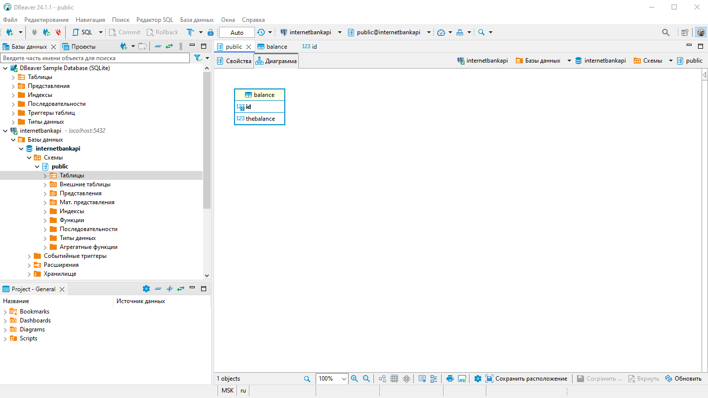
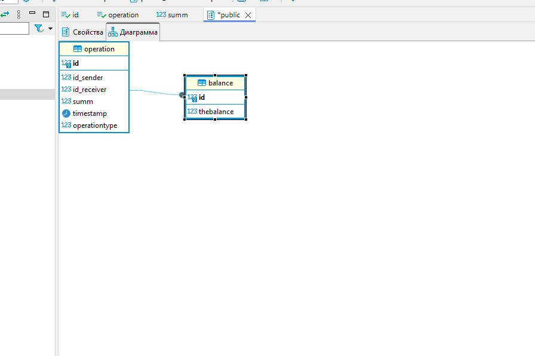

API для Интернет-банка
Задача: реализовать Rest API по работе с банковским счетом.
Этап 1
 Реализованы методы:
getBalance - баланс по ID клиента;
takeMoney - списание заданной суммы с баланса клиента;
putMoney - Пополнение баланса на заданную сумму;

Реализовано подключение к БД, создана таблица из ТЗ

Реализован RestApiController для управлением операциями с БД

Этап 2
-добавлена таблица в бд для операций, доработаны методы putMoney и takeMoney для записи в эту таблицу

-реализован метод для вывода списка операций, добавлена операция в RestAPI

Этап 3

- В очередной раз переработана бд, добавлены метод и операция transferMoney 
- написаны минимальные тесты